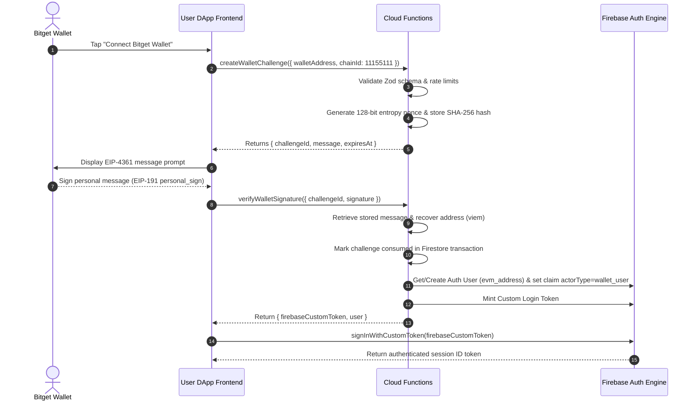

# Architecture & Monorepo Structure

This document outlines the architectural boundaries, repository structure, authentication mechanics, transaction verification flows, and deployment topology of the BSPC platform.

---

## Repository Workspace Layout

The project is managed as a `pnpm` monorepo with the following workspace packages:

```
├── apps
│   ├── admin               # Desktop Administration Dashboard (Next.js 16.3 App Router) [Implemented]
│   └── dapp                # Mobile-First User DApp (Next.js 16.3 App Router) [Implemented]
├── packages
│   ├── types               # Shared TypeScript domain models & database repositories [Implemented]
│   ├── validation          # Shared Zod validation schemas & constraint checkers [Implemented]
│   ├── firebase            # Shared Firebase client config & converter helpers [Implemented]
│   ├── web3                # EVM network configurations & EIP-4361 message builders [Implemented]
│   └── ui                  # Reusable UI component stubs & Tailwind merge utilities [Implemented]
├── functions               # Privileged Firebase Cloud Functions (13 functions, Node 18 TS) [Implemented]
├── firebase.json           # Firebase Emulator suite mapping & deployment configuration [Implemented]
├── firebase/
│   ├── firestore.rules     # Database access rules (Deny-all default) [Implemented & Tested]
│   ├── firestore.indexes.json # Firestore query index definitions [Implemented]
│   └── storage.rules       # Firebase Storage security rules [Implemented]
└── tests                   # Workspace Vitest unit test suite (76 tests) [Implemented & Verified]
```

---

## Deployment & Security Boundaries

```
+-----------------------------------------------------------------------------------+
|                                 Client Viewports                                  |
|                                                                                   |
|  +---------------------------+             +-----------------------------------+  |
|  |        apps/admin         |             |             apps/dapp             |  |
|  |  (Cookie-Guarded Admin   |             |   (Mobile Web3 Interface —        |  |
|  |   Dashboard)              |             |    Bitget EIP-1193 Provider)      |  |
|  +-------------+-------------+             +-----------------+-----------------+  |
+----------------|---------------------------------------------|--------------------+
                 | HTTPS Callable Requests                     | EIP-191 Personal Sign
                 v                                             v
+----------------------------------------+   Signature Proof   +--------------------+
|             Backend Layer              |<--------------------+   Bitget Wallet    |
|                                        |  createWalletChall. | (EIP-1193 Provider |
|  +----------------------------------+  |  verifyWalletSign.  |  Detected / Web3)  |
|  |     Firebase Cloud Functions     |  |                     +--------------------+
|  | (Claims Validation & Audit Logs) |  |                     +--------------------+
|  +------------------+---------------+  |                     |   WalletConnect    |
|                     |                  |                     | [Planned / Uninst] |
+---------------------|------------------+                     +--------------------+
                      v
+-----------------------------------------------------------------------------------+
|                                 Database Boundary                                 |
|                                                                                   |
|  +-----------------------------------+     +-----------------------------------+  |
|  |         Cloud Firestore           |     |       Firebase Auth Engine        |  |
|  |  (Strict rules; Direct ledger &   |     | (Issues ID Tokens containing      |  |
|  |   audit-log client writes DENIED) |     |  Custom Claims: actorType)        |  |
|  +-----------------------------------+     +-----------------------------------+  |
+-----------------------------------------------------------------------------------+
```

---

## Key Security Definitions: Custom Tokens vs Custom Claims

1. **Firebase Custom Login Tokens**:
   - Cryptographically signed JWTs minted on the server using `admin.auth().createCustomToken(uid, { actorType: 'wallet_user' })`.
   - Used by DApp clients to establish authenticated Firebase user sessions via `signInWithCustomToken(token)`.
   - *Implementation Status*: **Implemented & Unit Tested** inside `verifyWalletSignature` Cloud Function.

2. **Firebase Auth Custom Claims**:
   - Key-value attributes attached to a user's Firebase Auth token (`{ role: 'super_admin' }` or `{ actorType: 'wallet_user' }`).
   - Read by Cloud Functions (`context.auth.token`) and Firestore Rules (`request.auth.token`).
   - *Implementation Status*: **Implemented & Unit Tested** across all Cloud Functions and `firestore.rules`.

---

## Technical Context Flowcharts

### 1. Wallet Challenge Authentication [Implemented & Unit Tested]



---

## Feature Implementation Status Matrix

| Component / Feature | Implementation Status | Notes |
| :--- | :--- | :--- |
| **Admin Dashboard UI** | **Implemented** | 19 App Router pages built in Next.js 16.3 (`apps/admin`) |
| **User DApp UI** | **Implemented** | 9 Mobile-first App Router pages built in Next.js 16.3 (`apps/dapp`) |
| **Cloud Functions (13)** | **Implemented & Unit Tested** | Includes `createWalletChallenge`, `verifyWalletSignature`, `listUsers`, `getUserDetail`, `updateUserStatus`, `reviewWithdrawal`, `reviewApplicationRequest`, `createLedgerAdjustment`, `assignAdminRole`, `revokeAdminSessions`, `exportReport`, `getTeamReport`, `indexBlockchainEvents` |
| **Firestore Security Rules** | **Implemented & Unit Tested** | Deny-all default; 15 test scenarios passing in Vitest |
| **Unit Test Suite** | **Implemented & Unit Tested** | 76 Vitest unit tests covering web3, roles, wallet auth, indexer, and rules |
| **Bitget Wallet Detection** | **Implemented** | Detects `window.bitkeep?.ethereum` and `window.ethereum?.isBitKeep` |
| **EIP-4361 Sign-In Message** | **Implemented** | Standard EIP-4361 / EIP-191 personal_sign message format |
| **Firebase App Check** | **Implemented (Code)** / **Planned (Console)** | Code checks `ENFORCE_APP_CHECK=false` in dev; console enforcement planned |
| **WalletConnect SDK** | **Planned** | Packages not installed in monorepo |
| **Secure HttpOnly Admin Cookies** | **Planned** | Admin middleware currently uses client-set `document.cookie` string for demo |
