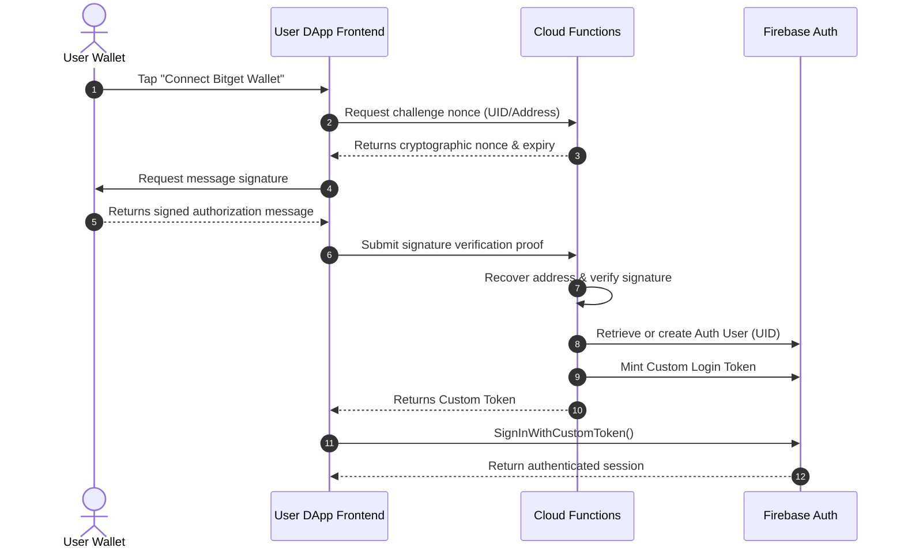
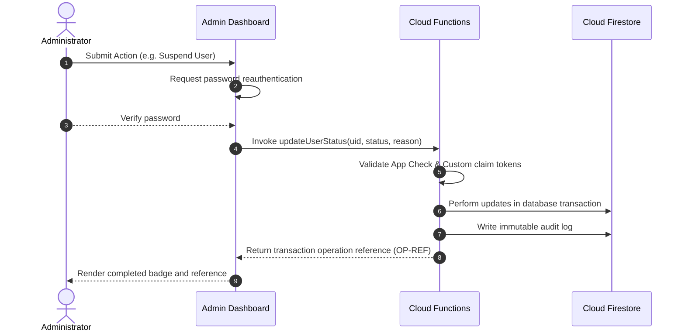

# Architecture & Monorepo Structure

This document outlines the architectural boundaries, repository structure, and data flows of the BSPC platform.

## Repository Workspace Layout

The project is managed as a pnpm monorepo with the following workspace configuration:

```
├── apps
│   ├── admin               # Desktop Administration Dashboard (Next.js App Router) [Implemented]
│   └── dapp                # Mobile-First User DApp (Next.js App Router) [Implemented]
├── packages
│   ├── types               # Shared TypeScript models and database repositories [Implemented]
│   ├── validation          # Shared Zod schemas validation constraints [Implemented]
│   ├── firebase            # Shared Firebase client integrations [Implemented]
│   ├── web3                # EVM network configurations & checksum helpers [Implemented]
│   └── ui                  # Reusable UI component stubs [Implemented]
├── functions               # Privileged Firebase Cloud Functions [Implemented]
├── firebase.json           # Firebase Emulator suite mapping [Implemented]
└── firestore.rules         # Security access rules [Implemented]
```

---

## Deployment & Security Boundaries

```
+-----------------------------------------------------------------------------------+
|                                 Client Viewports                                  |
|                                                                                   |
|  +---------------------------+             +-----------------------------------+  |
|  |        apps/admin         |             |             apps/dapp             |  |
|  |  (Cookie-guarded Admin)   |             |     (Mobile Web3 Interface)       |  |
|  +-------------+-------------+             +-----------------+-----------------+  |
+----------------|---------------------------------------------|--------------------+
                 | HTTPS Callable Requests                     | Injected Provider
                 v                                             v
+----------------------------------------+   Signature Proof   +--------------------+
|             Backend Layer              |<--------------------+   Bitget Wallet    |
|                                        |                     | (EIP-1193 Provider)|
|  +----------------------------------+  |                     +--------------------+
|  |     Firebase Cloud Functions     |  |
|  | (Claims validation & write logs) |  |
|  +------------------+---------------+  |
+---------------------|------------------+
                      v
+-----------------------------------------------------------------------------------+
|                                 Database Boundary                                 |
|                                                                                   |
|  +-----------------------------------+     +-----------------------------------+  |
|  |         Cloud Firestore           |     |       Firebase Auth Engine        |  |
|  | (Locked down by firestore.rules)  |     |   (Custom Token Admin Claims)     |  |
|  +-----------------------------------+     +-----------------------------------+  |
+-----------------------------------------------------------------------------------+
```

---

## Data Authoritative Model

To maintain Web3 compliance, the platform distinguishes between five data classes:

1. **On-Chain Authoritative**: Blockchain pool transactions, smart-contract balances, validator pool details. Verified strictly using block transactions logs hashes. [Planned / Mock Only]
2. **Off-Chain Authoritative**: Platform administrative status variables, user bans list, roles assignments. [Implemented / Firestore]
3. **Cached Data**: Current USD Coin exchange ratios or network average gas fees. [Planned]
4. **Pending Confirmation**: Unconfirmed payouts or deposits sweeps waiting for confirmation parameters. [Mock Only]
5. **Mock/Demo Data**: Simulated leverage transactions, demo APR stakes details, and dummy crypto assets values. [Implemented / Mock Mode]

---

## Technical Context Flowcharts

### 1. Wallet Challenge Authentication [Mock Only / Planned]



### 2. Privileged Administrative Mutation [Implemented]


